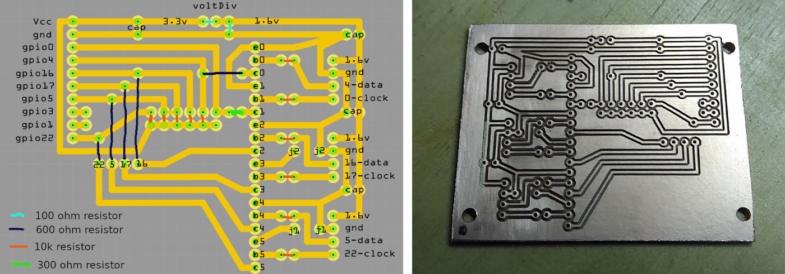
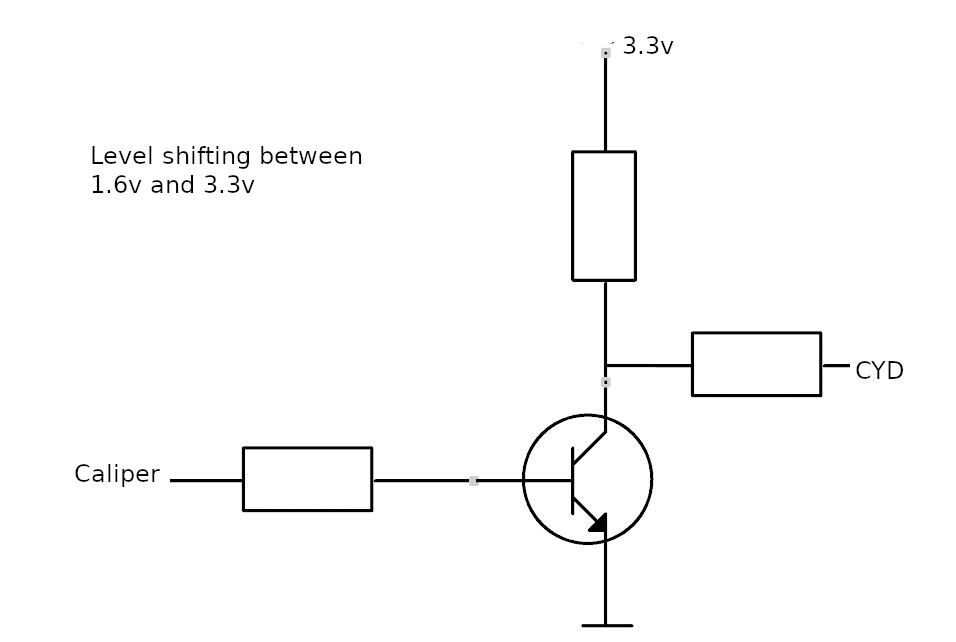
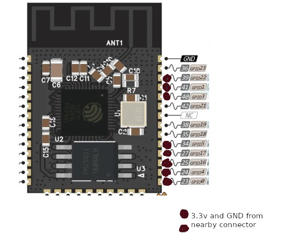

#PCB to interface the CYD to the digital calipers

  

The calipers operate at 1.5v so this is required to convert this to the 3.3v of the CYD.  It is a very simple circuit which uses a simple transistor to do this, I used my CNC router to cut a PCB but you could easily just build this on some strip board etc. I have seen others use the level shifters from eBay but I could not get mine to operate with the 1.5volts.  

The calipers are linked to the CYD via a ribon cable soldered directly to the ESP32 module (the 3 colour led needs to be removed). 
  

See [the main page](https://github.com/alanesq/DRO) for more info.  

--------------------
https://github.com/alanesq/DRO - alanesq@disroot.org
