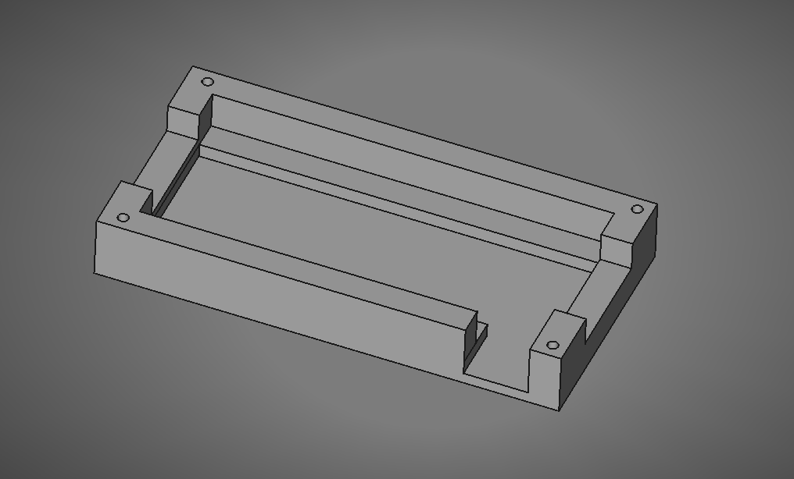
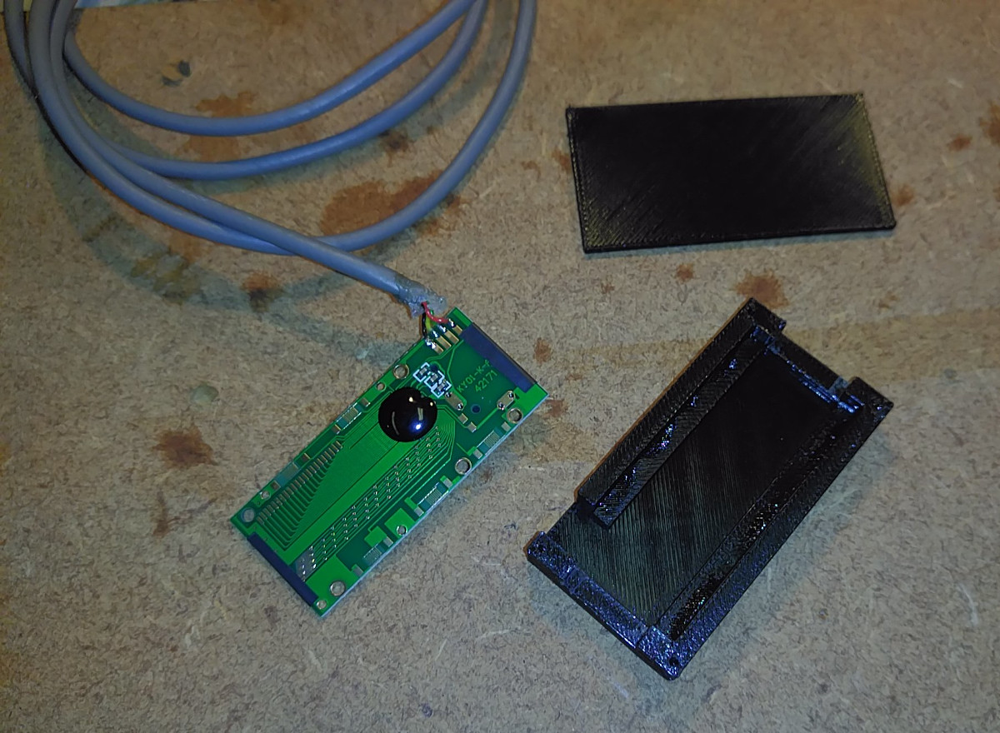

#3D printable case for digital caliper reader

This is a case I created for the digital calipers reader circuit board
The battery holder has to be removed from the PCB (they often just pull off as they are not soldered) and it can be installed in this case without the LCD display.

I have included the Freecad file and STL files

--------------------
https://github.com/alanesq/DRO - alanesq@disroot.org
