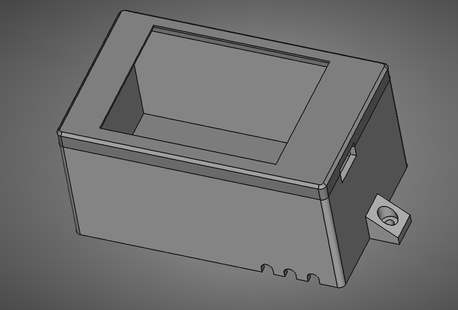

#3D printable case for the DRO project

The idea behind this case is the interface circuit board is attached to a surface (via pillars)
and then this case screws on to the base over the top of this circuit board
This way the case can be removed easily leaving the interface and all its cables in place.

The case can print with no supports if printed top side down
It takes around 2hrs on my printer

I have included an STL file for it along with the Freecad file

[The case here is based on this one created by mdkendall](https://www.printables.com/model/685845-enclosure-for-sunton-esp32-2432s028r-cheap-yellow-)

--------------------
https://github.com/alanesq/DRO - alanesq@disroot.org
